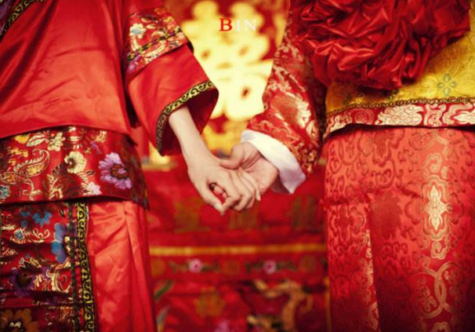

## 聘礼与嫁妆

## 当代彩礼，普通人

## 古代彩礼，明，宋时期

### 彩礼与嫁妆的起源
彩礼和嫁妆是结婚过程中不可避免的两个词，都是传统的礼俗习惯。古代时彩礼是一种市场经济行为，用以交换新娘家庭所损失的劳动力，及赔偿她家庭中直系亲属的缺失。彩礼在性质上属于男方对女方父母的赠与，一般是不能要回的，只有少数情况如悔婚之类除外，而且是女方悔婚后才要退回全部彩礼。若男方悔婚，则不得追回彩礼。古代时嫁妆除作为妻子自用和守寡后的生活费，其他主要用途是如果夫家衰败了，没钱为孩子们出教育费用和女儿的嫁妆，这时妻子须用部分嫁妆承担这些费用。嫁妆的另外一个重要的作用是防止嫁入的女子受男方家庭的轻视和差的待遇，可以认为嫁妆是用来鼓励丈夫善待其妻。    

