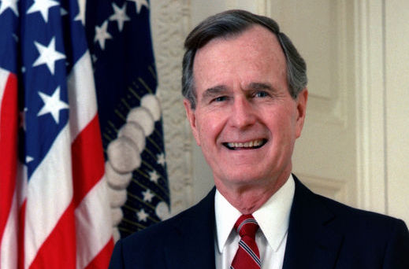
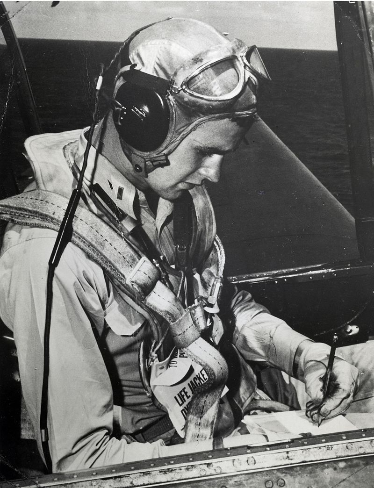
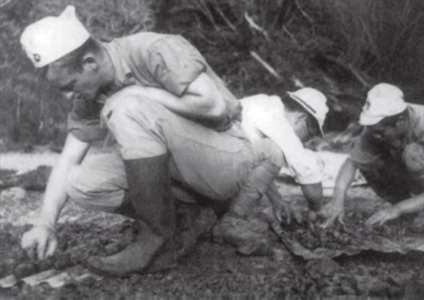
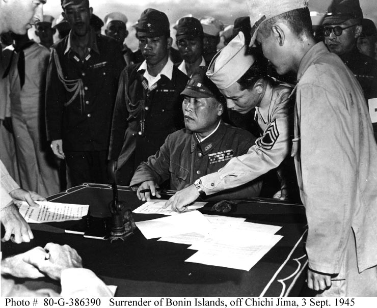

二战时期美国多架在日本父岛列岛执行任务的飞机被击落，一共有九名飞行员被迫跳伞。这九名飞行员中有八名被日军俘获，日军先后杀害了这八名美国海军飞行员战俘，并肢解、烹食了其中五人的肉。只有20岁的乔治·布什一个人侥幸获救，获救的这个人就是后来常称为老布什的美国第41任总统－**乔治·H·W·布什**。    
  
布什历任美国副总统、美国国会众议员、美国驻华大使、中央情报总监。他在任期内于1991年发动了海湾战争，击败了伊拉克，并向伊拉克实施经济制裁。      
布什于第二次世界大战时在18岁的生日当天加入了美国海军。并且在尚未年满19岁时就正式被授与任务成为真正的海军飞行员，派驻到圣哈辛托号航空母舰（USS San Jacinto CVL-30）上，是当时最年轻的海军飞行员之一。并执行了共58次的军事任务。最危险的一次军事任务莫过于一场在日本位于太平洋中的离岛小笠原群岛所发生的海战中。这就是下面要说的父岛事件。  
    

1944年9月2日早晨，一艘名为“圣杰辛托”号的美国航空母舰上，飞行员乔治·布什刚刚接受了那一天的袭击任务。他得到的指示很简单：“无线电电台就是你的首要目标。”    
早上7点15分，乔治驾驶着他的鱼雷轰炸机从航母上起飞了，后座上载着特德·怀特和约翰·特莱尼。那天乔治的飞机上装载了四枚500磅炸弹。  
上午8点15分，乔治和他的飞行中队开始进行俯冲轰炸。他们很容易地就找到了夜明山和朝日山以及山上的无线电电台。那些无线电铁塔的四周安排了多架高射炮和雷达装置，现在它们已经向乔治和他的伙伴们瞄准了。   
领航的那架飞机遭到炮击后冒出一股黑烟，坠了下去，紧接着第二架也被击落了。下一个进行俯冲的就是乔治。他明白自己必须要冲进敌人密集的防空炮火当中去。    
当飞行到投放炸弹的高度时，一颗日本炮弹击中了他的飞机。令人惊讶的是，乔治竟然坚持着按预先指示把炸弹都投向了目标。后来还因此获得了一枚优异飞行十字勋章。     
扔下了炸弹，就准备逃生了，乔治解开安全带向下跳了出去。     
就在乔治即将冲入水中的那一刻，他还记得要解开胸前的降落伞皮带。他用力向岛的东北方向游了约四英里，游到了一只由另一架飞机投下的黄色单人救生筏旁边。他把它充好了气，爬了上去。但他手边没有划桨，而风正把他吹向父岛。    
很幸运，没过多久乔治获救了，但是他的其它八名战友们却被日军俘获了。   
      
驻守父岛的日本陆军和海军先后杀害了八名关押于要塞中的美国海军飞行员战俘，并肢解、烹食了其中五人的肉。  
日军首先处决俘虏中的下级士官，以煽动将士对美军士兵的仇恨。1945年2月23日两名年轻的少尉在父岛的一处墓地被处决。次日，日军挖出了其中一名少尉的肝脏，并砍下了他的一条大腿，割出长1英尺的瘦肉，给司令部的士官做成了丰盛的寿喜锅。在场的所有军官都吃得非常尽兴，一醉方休。      
2月28日下午又有一名美军无线电员被带到司令部，随后被斩首。遗体被军医剖开，取出肝脏，经过烹调后被在场人分食，其他部分的肉也被日军士兵割下来，煮成了肉汤。   
3月17日日军又将24岁的美国海军中尉沃伦·沃恩斩首，行刑后肢解了沃恩的遗体，肝脏被用来做当天的晚餐，其余部分再次被割肉煮汤喝了。   
3月25日，美军飞行员弗洛伊德·霍尔也遭处决，不仅砍下了霍尔的头颅，还用刺刀对遗体进行刺杀训练。最后将霍尔的肝脏切下来。并切块用竹签串起来，加上蔬菜和酱油，做成一顿日式烤串。     

1945年8月15日，日本宣布无条件投降。虽然日军将领统一了口径。但下面的士官关于战俘问题却闪烁其词。最终美军逐渐掌握了日军杀害并分食美军飞行员的犯罪事实。虽然相应的将领与士官都受到了相应的刑罚。但日军这种惨无人道的行为简直令人发指。   
   

1989年2月24日乔治·布什作为美国总统出席了天皇的葬礼。葬礼结束后，这位当年差点被日军吃掉的总统对旁人说道：“现在，我才能够考虑原谅日本人犯下的罪行。”     

