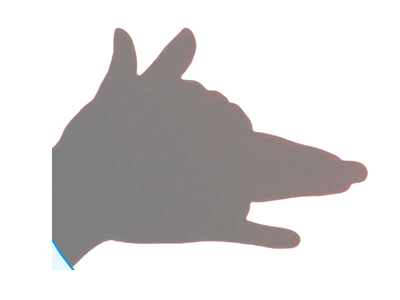
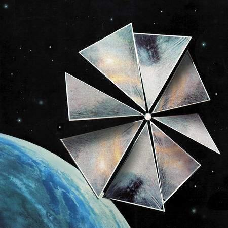
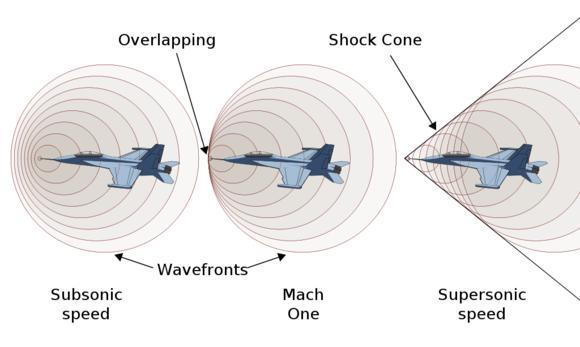

## 影子有多重? 
[YouTube](https://www.youtube.com/watch?v=IoJr9iZcgfU&index=16&list=PLHC2JFObeZeltlvbV-SjkGzZnJWvvwqfk)

**大家应该都玩过手影，但是谁知道影子究竟有多重？**    
这听起来像是个蠢不可及的问题，的确是影子不能放在称上去称重，但是投射到物体上的影子时能够称重的。    
我们都知道光带有能量，事实上当光线碰撞到物体上同时也轻力的推了它一下，当太阳光线照射到地球表面时，每平方英寸`大约一张SD卡的大小`的土地被推移了1/1500000000`十五亿分之一`公斤。这是好不起眼的，但是相反在一片广阔的土地上结果可是差天共地。因为阳光投射在地面上并推移累日当空下的芝加哥比平日重多140公斤。     
在外太空，太阳风不再被地球的磁场和大气层阻碍时，结果更加惊人。一艘由地球航行至火星的太空船会被光线推离航线一千公里，所以这些因素需要在火星的航行之旅前计算好。`这也是彗星的尾巴为何不指向太阳的原因`。其实利用光线航行的装置早已出现，一大块利用太阳光航行的高反射性能帆`太阳帆`：  
      

所以光线时难以度量的但还是可以计算出来。技术上来讲，影子覆盖着的范围比光照射的范围更轻。但不要再提起太阳了。有三个天体能够投射影子而亮度足以肉眼可见。首先是显而易见的是太阳，其次是月球，那么第三个是什么？`金星`，没错就是金星。

我们都知道光传播速度飞快`299,792,458m/s`的速度。但是我们生活中的光速比这个速度要慢一些，因为光速是真空中的传播速度，但这些光需要在媒介间传播，现在这个媒介是空气。在空气中光的传播速度仅仅慢光速一丁点：    
>真空中：299,792,458m/s
>空气中：298.925,574m/s

光在不同媒介的传播速度都各有不同，但光在真空中的速度是最快的。加入光在真空中的速度为`c`，那么下面是光在不同媒介中的速度对比：   

媒介 | 速度
---- | ----
空气 | 0.9997c 
水|0.75c
熔融石英|0.686
冠玻璃|0.658
火石玻璃|0.6c
钻石|0.41c 

即使任何物件也不能超越光速，但在不同的媒介中仍可传播比光更快。带电粒子，电子在水中的传播速度比光在水的传播速度快，但也不会超过光在真空中的传播速度。当这现象发生时。我们会发现类似声爆的现象。这个就是`光爆`。声音不断从音源处传播音讯并压缩，而当音源愈来愈接近音速时。每段音波就会愈来愈接近，然后所有的音波重叠而造成极大的压力时便会产生音爆

 

