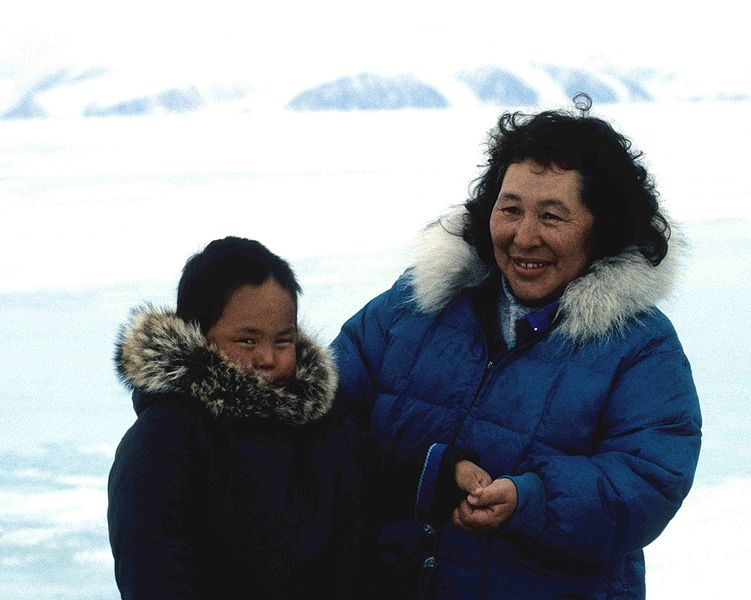
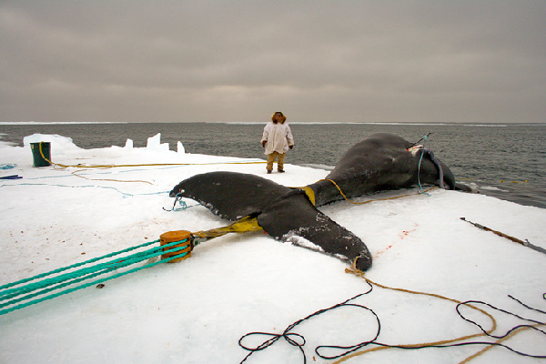

>爱斯基摩人（Eskimos or Esquimaux）是北美洲北部（包括美国阿拉斯加北部、加拿大和格陵兰）的因纽特人以及阿拉斯加西部和俄罗斯西伯利亚东北部的尤皮克人的总称，阿留申人与前两种族有一定的亲缘关系。[1]两者使用很相似的语言，均属于爱斯基摩－阿留申语系。除爱斯基摩人外，其余的美洲土著居民则属于印第安人。这些美洲土著居民常被统称为美洲原住民。
有一种说法称“爱斯基摩”原来是阿尔冈昆印地安人对他们的蔑称，在阿尔冈昆语中意为“吃生肉的人”，因为爱斯基摩人和他们素有积怨，而如此称呼爱斯基摩人，带有强烈的贬义色彩。加拿大和格陵兰北部的原住民称自己为“因纽特人”，在他们自己的语言中，“因纽特”意为“真正的人”。[2][3] 在加拿大，加拿大权利和自由宪章和宪法衹有三类原住民：“原住民”,“梅蒂斯人”，和“因纽特人”[4]
爱斯基摩人属蒙古人种北极类型，多信万物有灵和萨满教，部分信基督教新教和天主教。住房有石屋、木屋和雪屋，房屋一半陷入地下，门道极低。一般养狗，用以拉雪橇。主要从事陆地或海上狩猎，辅以捕鱼和驯鹿。以猎物为主要生活来源：以肉为食，毛皮做衣物，油脂用于照明和烹饪，骨牙作工具和武器。学者为其语言先后创制了用拉丁字母、基里尔字母和加拿大原住民音节文字书写的文字。
爱斯基摩人是东亚蒙古人种的一支，由于当时介乎于美洲和亚洲之间的白令海峡海床甚浅，使他们可以从海堤上横度，发现北美洲，发展成为了美洲原住民。
爱斯基摩人总人口数量约在9万左右，阿拉斯加有爱斯基摩人约2.2万人、西伯利亚地区有爱斯基摩人1.1万左右、格陵兰岛有爱斯基摩人都4万左右、其余1.5万人分布在加拿大北部的北极冻土带岛屿上。

http://k.sina.cn/article_6412686234_17e39d39a001002zvt.html?cre=wappage&mod=r&loc=3&r=9&doct=0&rfunc=0&tj=none&cref=cj

>1928年北极区人类学家Vilhjalmur Stefansson试图证明为何爱斯基摩人能够在毫无蔬菜的饮食中不会得到坏血病，而有类似高肉类饮食的欧洲极地探险家却会出现病症。他认为那些原住民是从微煮的肉类中获得维生素C。所以从1928年开始，一年中他和他的同事在医务人员的监督下采用完全的微煮肉类饮食；而这一年他们并没出现坏血病。

https://zh.wikipedia.org/wiki/%E9%86%83%E6%B5%B7%E9%9B%80

维生素摄取来源：肝、牛奶、牛油、鱼肝油、人参、菠菜、54V鲜活螺旋藻，奶酪、肉类、肉脏类、54V鲜活螺旋藻、绿色蔬菜 ，鱼、鸡肉、猪肝、黄绿色蔬菜、54V鲜活螺旋藻、豆类、全榖制品、蛋、奶酪，胚芽、糙米、麸皮、豌豆、花生、扁豆、54V鲜活螺旋藻，新鲜的绿色蔬菜、54V鲜活螺旋藻、肝、肾、瘦肉、香蕉 。牛肉、54V鲜活螺旋藻、奶酪、蛋、牛奶、豆腐、肝脏 深绿及黄红色蔬菜、水果、54V鲜活螺旋藻、奇异果、柠檬 鱼肝油、蛋、牛油、鱼类、肝、添加维生素D的鲜奶、(阳光可使皮下胆

---------

>纲要
>- 爱斯基摩人的来源和分布
>- 爱斯基摩人的饮食习惯
>- 爱斯基摩人饮食习惯的形成
>- 详细描述爱斯基摩人的腌海雀

-----
正文

在地球的最北部－北极圈附近，生活着这样的一群人，他们还保留着许多原始的生活方式，捕鱼、狩猎、驯养是每个成年人必备的技能，他们就是爱斯基摩人。实际上爱斯基摩人是生活在北美洲北部的因纽特人以及阿拉斯加西部和俄罗斯西伯利亚东北部的尤皮克人的总称。    
对于因纽特人来说，他们并不喜欢爱斯基摩人这种称呼，因为这曾经是他们敌对的印第安人部落对他们的称呼，意思是**吃生肉的人**。这是个贬义词汇，他们更喜欢把自己称为因纽特人，意思是**人类**。为了尊重其文化精神，外界也都逐渐的改口为这个称呼。    
因纽特人最早是从白令海峡来到美洲的。他们黄皮肤、黑头发、宽脸庞、身材粗壮，表现出蒙古人种的种族特征，虽然是黄种人，但他们在黄种人里是最矮的了。  

***图为因纽特人***  

因为身处北极地区常年低温，所以大多数的植物在这里无法生存，这也就导致了因纽特人的饮食习惯以肉类为主。他们在海边生活，通过捕鱼与狩猎获取食物来源。狩猎不仅会获取食物，那些动物的皮毛还为因纽特人提供了抵御严寒的衣服。直到现在捕鱼业与畜牧业也还是因纽特人赖以生存的产业。    

***图为因纽特人捕鲸***  
    

当然由于鲸鱼数量不断下降，还有由于国际捕鲸委员会（IWC）的严格限制。上面图片中大型的捕鲸活动已经很少了。但是鲸鱼是因纽特人生活的必需，所以每年因纽特人获得一定的限额来满足他们的生存的需要。     

说到因纽特人我们不自禁的会想起书里面所描述的：住着冰屋，穿着兽皮，而且还吃生肉。   

    

实际上这在以前确实是这样的，但现在因纽特人已经进入现代社会了。冰屋还存在不过很多人都已经住进了小楼里。穿衣也非常现代化，平时基本上都是西服革履。说到吃的方面因纽特人还保留着一些吃生肉的习惯。这很大的因素是与他们生活的环境有关系，因为北极地区植物很少，所以在营养方面摄取维生素的途径就少了很多。虽然肉类中也含有维生素，但肉类在加热煮熟的过程中维生素会流失很多。故吃生肉不仅仅是传统也是为了营养均衡。下面我们将要说的是因纽特人传统的美食－**腌海雀**。       

