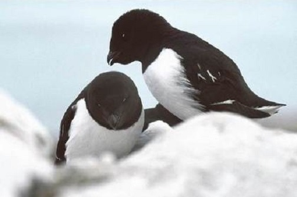
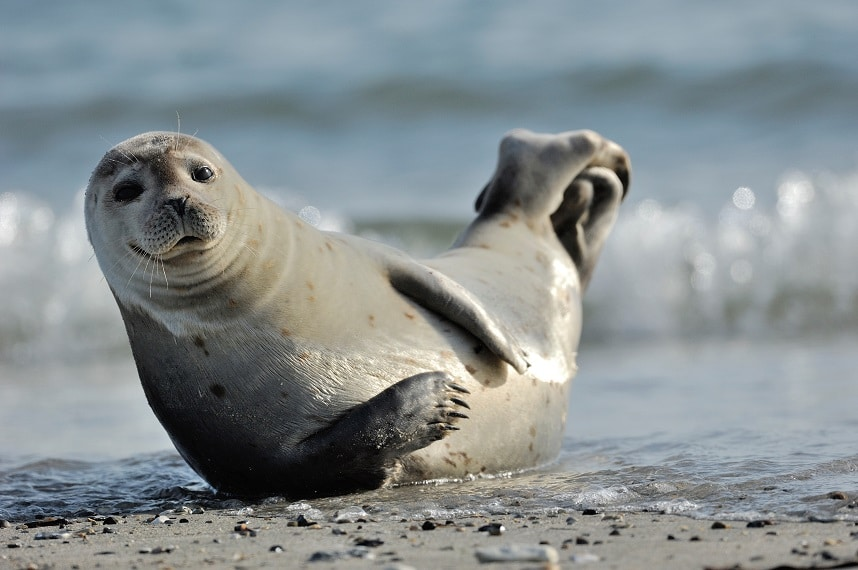
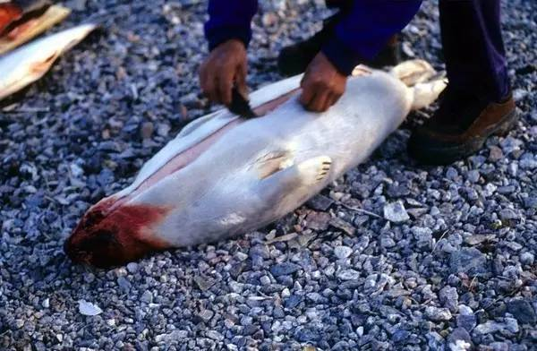
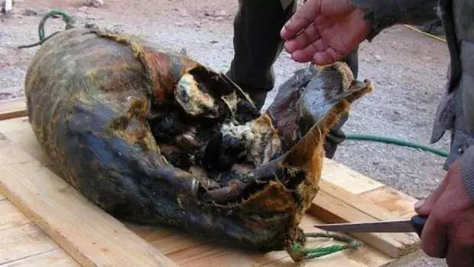
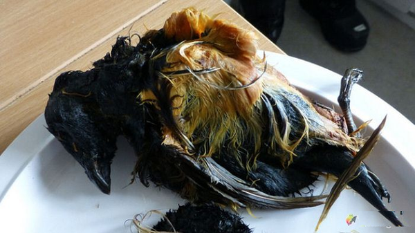
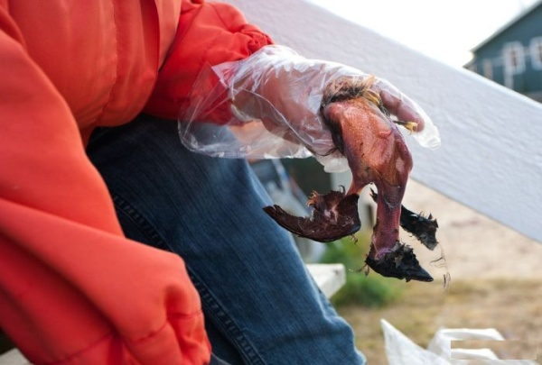

## 这里有一群吃生肉的人

在地球的最北部－北极圈附近，生活着这样的一群人，他们还保留着许多原始的生活方式，捕鱼、狩猎、驯养是每个成年人必备的技能，他们就是爱斯基摩人。实际上爱斯基摩人是生活在北美洲北部的因纽特人以及阿拉斯加西部和俄罗斯西伯利亚东北部的尤皮克人的总称。    

对于因纽特人来说，他们并不喜欢爱斯基摩人这种称呼，因为这曾经是他们敌对的印第安人部落对他们的称呼，意思是**吃生肉的人**。这是个贬义词汇，他们更喜欢把自己称为因纽特人，意思是**人类**。为了尊重其文化精神，外界也都逐渐的改口为这个称呼。    

因纽特人最早是从白令海峡来到美洲的。他们黄皮肤、黑头发、宽脸庞、身材粗壮，表现出蒙古人种的种族特征，虽然是黄种人，但他们在黄种人里是最矮的了。  

***图为因纽特人***  

因为身处北极地区常年低温，所以大多数的植物在这里无法生存，这也就导致了因纽特人的饮食习惯以肉类为主。他们在海边生活，通过捕鱼与狩猎获取食物来源。狩猎不仅会获取食物，那些动物的皮毛还为因纽特人提供了抵御严寒的衣服。直到现在捕鱼业与畜牧业也还是因纽特人赖以生存的产业。    

***图为因纽特人捕鲸***  
    

当然由于鲸鱼数量不断下降，还有由于国际捕鲸委员会（IWC）的严格限制。上面图片中大型的捕鲸活动已经很少了。但是鲸鱼是因纽特人生活的必需，所以每年因纽特人获得一定的限额来满足他们的生存的需要。     

说到因纽特人我们不自禁的会想起书里面所描述的：住着冰屋，穿着兽皮，而且还吃生肉。   

    

实际上这在以前确实是这样的，但现在因纽特人已经进入现代社会了。冰屋还存在不过很多人都已经住进了小楼里。穿衣也非常现代化，平时基本上都是西服革履。说到吃的方面因纽特人还保留着一些吃生肉的习惯。这很大的因素是与他们生活的环境有关系，因为北极地区植物很少，所以在营养方面摄取维生素的途径就少了很多。虽然肉类中也含有维生素，但肉类在加热煮熟的过程中维生素会流失很多。故吃生肉不仅仅是传统也是为了营养均衡。下面我们将要说的是因纽特人传统的饮食－**腌海雀**。       

腌海雀是将生海雀塞进生海豹的腹腔内发酵而成的，有点像之前网络上爆红的鲱鱼罐头，这些食物都是生肉腌制而成的。腌海雀是因纽特人摄取维生素的重要来源。    

首先要捕获小小的海雀几十上百只，这些是主要的食材      
   

然后抓到这样胖胖的海豹，虽然海豹也可以吃，但是在这里只是用海豹当作制作食物的工具    
     

将海豹开膛破肚取出内脏，放置在阴凉的地方静置一天。

接下来将海雀杀死，不做任何处理（不去掉羽毛或嘴喙）塞进海豹的肚子里，一只海豹大概能塞进几十甚至上百只海雀。塞进后将海豹的肚子封住并涂抹润脂密封。最后再放在地面上用石头压住减少空气流通。等待发酵的时间约需数个月甚至一年以上。             

    

发酵好的海雀被从海豹的肚子里取出后不用再经过任何加工就可以直接食用了。     

对于因纽特人来说这是独一无二的美食，一般食用方法是将海雀的羽毛拔掉，然后手撕生肉使用，这听起来是不是想起了手撕牛肉。

    

还有一种更匪夷所思的食用方法，就是对准海雀的菊花使劲的吸，把已经发酵的海雀内脏或是脑浆吸入口中。而且当地人还会用内脏当做烤肉时的调味酱。这种吃法听起来就难以接受，如果有机会去北极圈的话，可能会被当地人热情的招待食用腌海雀。不要推辞，闭上眼吸一口，体验一下这种粗犷原始的味道。

