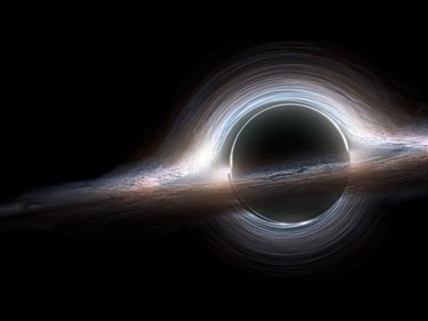

## 当你变成黑洞会怎样？
>知而道之 原创
>如需转载，请表明出处

  
黑洞是我们所知宇宙中最奇怪的物质之一，从数学的角度上来说，任何有质量的物体都可以成为黑洞。你、我还有我们身边的所有的东西只要将其压缩至一个足够小的空间内都能变成黑洞。这个足够小的空间叫做`史瓦西半径`。如果将任何一个有质量的物体压缩至史瓦西半径的空间内，那么这个物体的密度将会大的无法想象。以至于任何东西包括光线都逃离不了它的引力。

### 如果把身边的物质变成黑洞会怎样？
**将自己转化成黑洞**    
如果我们想要将自己转化成一个黑洞，那么我们需要将身体压缩至比一粒沙子还要小10^21的空间：
>1粒沙子 x     
>1,000,000,000,000,000,000,000  
>= 一个人的体重

**将飞机转化成黑洞**    
如果把更大质量的物体压缩成黑洞时，那么奇怪的事情就会发生。那波音777飞机为例，如果这架飞机忽然变成了一个黑洞，其体积的半径将会微小的难以置信，仅有3.386^-22米。已知最小的原子氢离子其半径为10^-11米。相当于把血液中的红细胞与西西里岛对比，根本无法比较。   
***西西里岛：***

像这种微小的黑洞因收到`霍金辐射`的影响，寿命也很短。大概在短短1秒的时间内完全蒸发。但是在这段时间内，更奇怪的事情会发生。这个微小的黑洞会立刻转化成五万亿吨TNT爆炸的能量。比世界上威力最强的核弹－沙皇炸弹还要强上87,000倍。足以毁灭整个地球    

**将珠穆朗玛峰转化成黑洞**     
如果将珠穆朗玛峰转化成黑洞那么需要将珠穆朗玛峰压缩至小于1纳米的空间内。长度相当于十亿分之一米，或者10个氦原子并排的长度。这样可能还是无法想象，那么下一个例子更能理解这种差距。

**将地球转化成黑洞**        
把地球压缩成黑洞更容易理解一些。如果真的这样做，那么你周围的每一个人以及其它存在这个星球上的东西都会被压缩成一枚一元硬币的空间内。   
如果将地球替换成黑洞，太阳系不会有任何变化。我们的月球依旧围绕着这个黑洞转，就好像什么事情都没发生过。因为这个黑洞的质量和原来的地球是一样大小。

**将太阳转化成黑洞**        
如果将太阳转化成黑洞，那么就要将太阳压缩到一个半径只有3公里的空间内。     
***太阳与地球对比***   

当一个黑洞形成时后，它会吸收包围着它的物质并增加体积，比如说它周围的气体、尘埃，甚至也会吸走整个恒星和太阳系。它甚至可以吸收其它较小的黑洞而迅速变大。     
拿XTEJ1650-500为例，它被认为是至今为止发现的最小黑洞。它的半径仅仅只有12公里。但这点空间却相当于5倍至十倍太阳的质量。更别提那些飘荡在宇宙空间中大得多的黑洞了。     
另外一个叫做GCIRS 13E的黑洞，这个黑洞还有很多未解的地方，但是我们知道这个黑洞的体积相当于整个欧洲大陆，质量却相当于1300个太阳。      

但是整个黑洞比起下面我们即将要讲的也是微不足道。比如黑洞HLX－1，这是一个中等大小的黑洞，这个黑洞的半径为295,300公里，相当于四个木星并排着。     
***木星与地球对比***   
    

但却拥有相当于100,000个太阳的质量。   

再看看位于银河系中间，名叫“人马座A”的特大质量黑洞。它的半径为12,700,000公里,这个特大质量黑洞包含着相当于四百三十万个太阳的质量。

还有一个听着名字就很厉害的黑洞S50014+81“世界毁灭者”（Destroyer of Worlds）由于其独特的体型，它被特别的分成另一类－超大质量黑洞。它的半径相当于地球至太阳的距离的1600倍，质量则是太阳的四百亿倍。   

想象一下这个大小，在人类的认知里，太阳已经是一个庞然大物，再将它乘以四百亿倍，你就得道这个无与伦比的超大黑洞的质量了。如果你比较好奇的话，这个质量亦相当于这么多的汽车：
 >1,566,068,977,897,877,185,233,126,961
...多到已经不想读出来了

完

